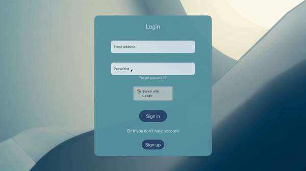

# Personal Task Master

Personal Task Master is a convenient online platform for creating, tracking, and managing tasks. Register, add tasks, mark them as completed, and monitor your progress. A simple and intuitive way to boost productivity in your daily life.

## 🚦 Project status

- [x] Live 🚀 
  
- [ ] Completed ✅
  
- [ ] Testing 🔎
  
- [ ] OnHold ⏸️
  
- [ ] In Development 🛠️
  
- [ ] Planned 📆

## 🖼️ Screenshots/Demo

## 💻 Usage

Access the project at the following URL: [taskmaster.nikita-smolenskyi.pl](https://taskmaster.nikita-smolenskyi.pl)

## 🌱 Contribution Guidelines

 - If you have suggestions to enhance the project, I welcome your ideas. Open a new issue or submit a pull request.
  
 - Found a bug ? Please create a new issue and share the details so that I can fix it as soon as possible.
  
## 📄 License

Information about **license** you can find in appropriate <u style="color: lightblue">[file](LICENSE)</u>.

## 🧑‍🎨 Author

Nikita Smolenskyi                  
smolenskyi.nikita@gmail.com